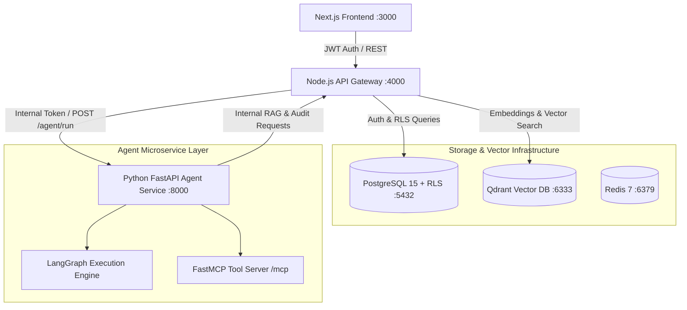

# Enterprise AI Workforce & Workflow Platform


-blue)


The **Enterprise AI Workforce & Workflow Platform** is a multi-tenant, agentic AI orchestration system designed to automate cross-functional enterprise operations. Powered by **LangGraph**, **FastMCP (Model Context Protocol)**, **Qdrant RAG**, and **Next.js**, the platform unifies specialized AI agents (Sales SDR, HR Operations, Finance & Ledger, Procurement, Coding & Repositories, and Executive Analytics) with Human-in-the-Loop approval workflows and an interactive visual workflow builder.

---

## 🌟 Key Features & Specialized Agents

### 🤖 Specialized AI Workforce
- **🎯 Sales SDR Agent:** Autonomous lead discovery (via Crawl4AI web crawling), contact & deliverability verification (Hunter.io / Emailable / ZeroBounce), personalized outreach copy generation, and background campaign execution loops with time-bound quota polling.
- **👥 HR & People Operations Agent:** Employee onboarding automation, attendance tracking, leave request processing, policy Q&A, and scheduled background HR polling engine.
- **📊 Executive Analytics Agent:** Real-time cross-departmental aggregation of HR, Finance, and Project performance metrics, live employee headcount tracking, agent execution health monitoring, and system cost breakdown.
- **💼 Finance Agent:** Real-time departmental budget management, spend & revenue tracking, and automated ledger integration synchronized with Sales & Procurement agents.
- **📦 Procurement Agent:** Vendor selection, automated RFQ/RFP generation, dynamic vendor scoring matrices, and vendor contract tracking.
- **💻 Coding Agent:** Repository discovery, secure tenant-level GitHub token resolution, structural code parsing, code analysis, and automated refactoring/PR proposals.
- **💬 ReAct Customer Support & RAG Agent:** StateGraph-driven conversational assistant with FLARE-style intent classification to skip vector search for tool queries, context-aware RAG answering with inline citations, and human approval checkpoints.

### 🌐 Core Platform Capabilities
- **🔒 Multi-Tenancy & Row-Level Security (RLS):** Strict data isolation enforced natively in PostgreSQL via session-scoped RLS policies (`app.tenant_id`) and JWT claims.
- **⚡ RAG Pipeline (Retrieval-Augmented Generation):** PDF/DOCX text extraction (pdf-parse / mammoth), content-aware semantic chunking (headings/paragraphs), Google Gemini `embedding-001` vectors, and Qdrant tenant-filtered vector search.
- **🧩 FastMCP Tool Gateway:** Standardized Model Context Protocol (FastMCP) integration over Streamable HTTP, enabling dynamic tool binding, Pydantic argument validation, and strict three-stage execution safety.
- **🛡️ Human-in-the-Loop (HITL) Approvals:** High-risk actions (e.g., refunds, payment processing, human escalation, budget updates) are intercepted and queued for human reviewer approval before execution.
- **🎨 Interactive Visual Workflow Builder:** React Flow / `@xyflow/react` node-based canvas for constructing, editing, and executing custom multi-step agent workflows visually.
- **👁️ Audit & Observability:** Fire-and-forget structured audit logging across all agent steps, tool executions, document uploads, and human decisions.

---

## 🏗️ Architecture & Component Topology



---

## 💻 Tech Stack

| Layer | Technology / Libraries |
|---|---|
| **Frontend** | Next.js 16 (App Router), React 19, Tailwind CSS, `@xyflow/react` (React Flow), Lucide Icons |
| **API Gateway** | Node.js, Express, Helmet, CORS, JWT (`jsonwebtoken`), Bcrypt.js, `pg` (Postgres client with RLS) |
| **Agent Orchestration** | Python 3.11+, FastAPI, LangGraph, LangChain, FastMCP, Pydantic v2, AsyncPG |
| **AI & RAG Engine** | Google Gemini 2.5 Flash / Embedding-001, OpenRouter (GPT-4o-mini), Ollama (Local Llama 3.2), Crawl4AI, Playwright |
| **Databases** | PostgreSQL 15 (RLS), Qdrant Vector DB, Redis 7 (Alpine) |
| **Tooling & Dev Ops** | Docker & Docker Compose, Nodemon, Uvicorn |

---

## 📁 Repository Structure

```
Enterprise AI Workflow Platform/
├── docker-compose.yml          # Postgres, Qdrant, and Redis services
├── .env.example                # Unified environment variable template
├── docs/                       # Architectural specs and engineering reports
│   ├── architecture_overview.md
│   ├── ai_sales_sdr_agent_report.md
│   ├── hr_agent_documentation.md
│   └── ...
├── frontend/                   # Next.js 16 Dashboard & Visual Workflow Canvas
│   ├── src/app/                # App router (sales, hr, finance, analytics, coding, pm, mcp, etc.)
│   ├── src/components/         # Reusable UI components & React Flow canvas
│   ├── package.json
│   └── tailwind.config.js
├── backend/                    # Node.js Express API Gateway & RAG Engine
│   ├── src/
│   │   ├── index.js            # Express server entry point
│   │   ├── db/                 # RLS-aware Postgres client pool
│   │   ├── routes/             # API routes (auth, conversations, agents, hr, sales, finance, analytics, coding, mcp)
│   │   ├── middleware/         # JWT Auth & RBAC (admin, employee, reviewer)
│   │   └── services/           # PDF/DOCX extraction, chunking, Gemini embeddings, Qdrant client
│   ├── database/migrations/    # SQL Schema & RLS policy migrations (001 to 005)
│   └── package.json
└── agent/                      # Python FastAPI + LangGraph Agent Microservice
    ├── main.py                 # FastAPI app & FastMCP endpoint
    ├── config.py               # Pydantic settings configuration
    ├── routers/                # Agent endpoints (sales, hr, analytics, finance, procurement, coding, workflows)
    ├── graph/                  # LangGraph StateGraph, Intent Classifier, Retriever, Reasoning, Approval nodes
    ├── services/               # Gemini / OpenRouter / Ollama LLM gateways
    ├── tool_gateway/           # FastMCP server, tool registry & safety checks
    └── requirements.txt
```

---

## 🚀 Getting Started

### Prerequisites
Make sure you have the following installed on your local system:
- **Node.js** v18+ and **npm** v9+
- **Python** 3.11+ and `pip` / `venv`
- **Docker** and **Docker Compose**
- **Google Gemini API Key** (or OpenRouter / Ollama for local LLM execution)

---

### 1️⃣ Clone the Repository & Configure Environment

```bash
git clone https://github.com/MHassaanT/Enterprise_AI_Workflow_Platform.git
cd "Enterprise AI Workflow Platform"

# Create .env files from templates
cp .env.example .env
cp .env.example backend/.env
cp .env.example agent/.env
```

Edit `backend/.env` and `agent/.env` to provide your **`GEMINI_API_KEY`**, **`JWT_SECRET`**, and database credentials.

---

### 2️⃣ Start Infrastructure Services (Docker)

Launch PostgreSQL, Qdrant Vector DB, and Redis via Docker Compose:

```bash
docker-compose up -d
```

Verify containers are healthy:
- **PostgreSQL:** `localhost:5432`
- **Qdrant Web Dashboard:** `http://localhost:6333/dashboard`
- **Redis:** `localhost:6379`

---

### 3️⃣ Setup & Start Node.js API Gateway

```bash
cd backend
npm install

# Run Database Migrations (if needed)
node database/run_migrations.js

# Start in Development Mode (Port 4000)
npm run dev
```

---

### 4️⃣ Setup & Start Python Agent Orchestration Service

In a new terminal window:

```bash
cd agent

# Create virtual environment
python -m venv .venv
source .venv/bin/activate  # On Windows: .venv\Scripts\activate

# Install dependencies
pip install -r requirements.txt
playwright install chromium  # Required for Crawl4AI web scraper

# Start FastAPI Microservice (Port 8000)
uvicorn main:app --reload --port 8000
```

---

### 5️⃣ Setup & Start Next.js Frontend

In a third terminal window:

```bash
cd frontend
npm install

# Start Next.js Development Server (Port 3000)
npm run dev
```

Open your browser at **`http://localhost:3000`** to access the Enterprise UI!

---

## 🛰️ Core API Endpoint Reference

| Service / Domain | Method & Path | Description | Access |
|---|---|---|---|
| **Auth** | `POST /api/auth/register` | Register tenant & admin user | Public |
| **Auth** | `POST /api/auth/login` | Authenticate user & return JWT | Public |
| **Conversations** | `POST /api/conversations/:id/messages` | Send message to Agent / RAG pipeline | JWT |
| **Documents** | `POST /api/documents` | Upload PDF/DOCX for RAG ingestion | JWT (Admin/Employee) |
| **Approvals** | `PATCH /api/conversations/approvals/:id` | Approve or reject pending agent action | JWT (Admin/Reviewer) |
| **Sales SDR** | `POST /api/sales/run-campaign` | Trigger autonomous sales SDR campaign loop | JWT |
| **HR Operations** | `GET /api/hr/attendance` | Fetch employee attendance records | JWT |
| **Finance** | `GET /api/finance/budget` | Fetch departmental budget vs spend | JWT |
| **Analytics** | `GET /api/analytics/overview` | Executive aggregated business metrics | JWT |
| **Coding Proxy** | `POST /api/coding/repos` | Interrogate GitHub repos via agent | JWT |
| **Internal RAG** | `POST /internal/rag/query` | Vector search & chunk retrieval | Internal Token |
| **Internal Audit** | `POST /internal/audit` | Record audit trail entry | Internal Token |
| **FastMCP** | `GET/POST /mcp` | FastMCP Tool Surface (Streamable HTTP) | FastMCP Client |

---

## 🔒 Security & Multi-Tenancy Architecture

1. **Row-Level Security (RLS):** Every PostgreSQL query executed by the Node backend sets session context `SET app.tenant_id = '...'`. PostgreSQL policies restrict `SELECT`, `INSERT`, `UPDATE`, and `DELETE` exclusively to matching rows.
2. **Inter-Service Token Header (`X-Internal-Token`):** Direct communication between the Node API Gateway and Python Agent Service requires a shared secret token header. Internal endpoints (`/internal/*`) reject unauthorized callers.
3. **Pydantic Tool Input Validation:** All tool arguments passed to Python agents undergo strict Pydantic type parsing, preventing injection attacks or improper schema executions.
4. **Three-Stage Tool Execution Gate:** Tool execution verifies:
   - Allowlist permission check against agent instance configuration.
   - Pydantic schema validation.
   - Pre-execution audit logging.

---

## 📄 Documentation & Reports

Detailed technical documentation and architecture design reports are available in the [`docs/`](file:///home/hassaan/Desktop/Projects/Enterprise%20AI%20Workflow%20Platform/docs) directory:
- [`docs/architecture_overview.md`](file:///home/hassaan/Desktop/Projects/Enterprise%20AI%20Workflow%20Platform/docs/architecture_overview.md) — Comprehensive architecture & design document.
- [`docs/ai_sales_sdr_agent_report.md`](file:///home/hassaan/Desktop/Projects/Enterprise%20AI%20Workflow%20Platform/docs/ai_sales_sdr_agent_report.md) — Sales SDR autonomous lead generation report.
- [`docs/hr_agent_documentation.md`](file:///home/hassaan/Desktop/Projects/Enterprise%20AI%20Workflow%20Platform/docs/hr_agent_documentation.md) — HR Agent workflow and polling architecture.
- [`docs/ai_analytics_agent_scope_and_capability_report.md`](file:///home/hassaan/Desktop/Projects/Enterprise%20AI%20Workflow%20Platform/docs/ai_analytics_agent_scope_and_capability_report.md) — Cross-departmental analytics documentation.

---

## 📜 License

This project is licensed under the **MIT License**.
