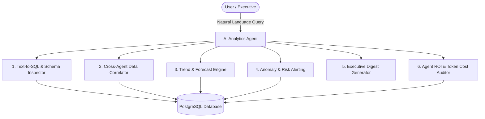
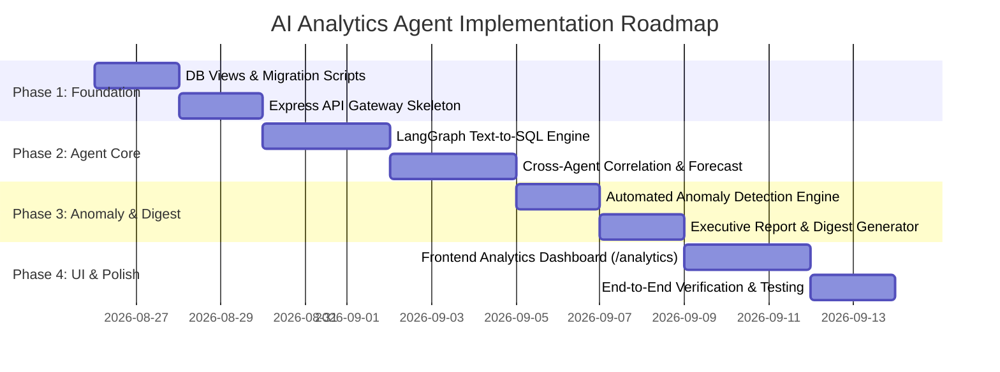

# AI Analytics Agent: Scope & Capability Specification Report

> [!NOTE]
> **Project Context:** Enterprise AI Workflow Platform
> **Document Purpose:** Comprehensive Analysis, Architectural Blueprint, Scope Definition, and Functional Capability Specification for the upcoming **AI Analytics Agent**.

---

## 1. Executive Summary & System Context

The **Enterprise AI Workflow Platform** is a multi-tenant, microservice-architected workspace featuring domain-specific AI agents:

- **Sales Agent (AI SDR):** Lead discovery via Hunter.io, verification, prospect scoring, and cold email campaign dispatch.
- **Procurement Agent:** Vendor discovery, RFQ generation, bid comparison, cost negotiation, and purchase order approvals.
- **HR Agent:** Employee onboarding, leave management, automated attendance verification (geofencing, IP whitelist, QR), team tracking.
- **Finance Agent:** Departmental budget setting, expense logging, revenue tracking, gross profit calculation, and cash flow variance.
- **Coding Agent:** GitHub repository indexing, code file tree analysis, PR review automation, issue resolution.
- **Project Management (PM) Agent:** Task assignment, milestone tracking, deadline reminders.
- **Workflows & MCP Tool Gateway:** Multi-step tool bindings, cross-agent workflows, and centralized audit logging (`cross_agent_audit_logs`).

### The Core Problem & Value Proposition

While each agent effectively manages operational tasks within its specific domain, leadership and operations teams currently face a **siloed analytics problem**:
1. Metrics are scattered across individual domain pages (e.g., Sales leads in `/sales`, budgets in `/finance`, attendance in `/hr`).
2. There is no unified mechanism to run **cross-departmental analysis** (e.g., *“How does engineering sprint velocity correlate with HR attendance and sales campaign launches?”* or *“What is our ROI across all active AI agents relative to total LLM API token consumption?”*).
3. Querying non-standard data requires manual SQL queries or building bespoke frontend views for every new question.

The **AI Analytics Agent** serves as the **Central Business Intelligence & Data Synthesis Engine** for the platform. Operating as a conversational and automated analytical supervisor, it leverages **Text-to-SQL**, **LangGraph multi-step reasoning**, **Predictive Time-Series Analytics**, and **Automated Executive Digesting** to unlock actionable cross-agent insights.

---

## 2. Core Objectives of the AI Analytics Agent

1. **Cross-Domain Data Unification:** Aggregate data across Sales, Procurement, HR, Finance, Coding, and System Audit Logs into a unified analytical schema.
2. **Conversational Data Exploration (NL-to-SQL):** Enable users to query platform data using plain English (e.g., *"Show me departments exceeding budget alongside their recruitment count this quarter"*).
3. **Automated Anomaly & Risk Detection:** Flag suspicious operational patterns (e.g., abnormal spikes in procurement spend, attendance drop-offs, or runaway LLM token costs).
4. **Predictive Analytics & Trend Forecasting:** Provide mathematical time-series forecasting for revenue trajectories, cash burn rates, employee leave trends, and lead conversions.
5. **Executive Digest & Report Generation:** Generate rich, downloadable executive briefings (Markdown/PDF) with embedded chart visualizations.
6. **Agent Operational Efficiency & Cost Monitoring:** Measure platform health, agent latency, execution success rates, and token cost per agent run.

---

## 3. Comprehensive Functional Capabilities



### Capability 1: Natural Language Data Exploration (NL-to-SQL Engine)
- **Schema-Aware Query Generation:** Translates complex user questions into syntactically valid PostgreSQL queries using tenant schema context.
- **Tenant Isolation Safeguards:** Injects Row-Level Security (`SET app.tenant_id = '...'`) into every query execution to prevent cross-tenant data leaks.
- **Read-Only Safety Guardrails:** Restricts generated queries to `SELECT` operations, blocking `INSERT`, `UPDATE`, `DELETE`, `DROP`, or DDL executions.
- **Explanation & Source Attribution:** Explains query logic in plain English alongside tabular output and chart recommendations.

### Capability 2: Cross-Agent Unified Metrics & Correlation Engine
- **Sales + Finance:** Calculates Customer Acquisition Cost (CAC) vs. Lifetime Value (LTV), campaign ROI, and procurement spend per acquired client.
- **HR + Coding:** Correlates employee attendance/leave patterns with code commit volume and PR turnaround speed.
- **Procurement + Finance:** Identifies unbudgeted vendor RFQs, supplier cost increases over time, and budget consumption per vendor category.
- **PM + HR:** Analyzes project completion velocities against team capacity and employee leave schedules.

### Capability 3: Predictive Analytics & Trend Forecasting
- **Revenue & Cash Burn Forecasting:** Projects 30-60-90 day runway and revenue goals based on historical sales velocity and procurement commitments.
- **Workforce Capacity Forecasting:** Predicts upcoming resource bottlenecks based on pending project milestones vs. historical leave frequencies.
- **Lead Generation Trajectory:** Estimates future pipeline conversions based on historic Hunter.io email reply rates and contact fit scores.

### Capability 4: Automated Anomaly & Risk Alerts
- **Budget Variance Warning:** Triggers alerts when a department spends >80% of its budget before 50% of the month has elapsed.
- **Lead Quality / Bounce Spike Alert:** Identifies sudden drops in sales campaign deliverability or high email bounce rates.
- **Attendance & Productivity Anomalies:** Flags abnormal absenteeism or low check-in rates across specific teams.
- **LLM API Usage Surges:** Alerts administrators if agent token consumption suddenly spikes due to looping execution or excessive tool calls.

### Capability 5: Executive Digest & Automated Report Generator
- **Daily/Weekly Briefings:** Automatically synthesizes key metrics across all domain agents into a structured Executive Summary report.
- **Custom Report Creator:** Allows users to schedule or on-demand generate custom reports (e.g., *"Monthly Financial & HR Audit Report"*).
- **Export Capabilities:** Supports PDF, Markdown, and CSV/Excel exports with pre-formatted charts and graphs.

### Capability 6: Platform Health & Agent ROI Monitoring
- **Cost Per Agent Execution:** Tracks token consumption (prompt/completion tokens) for Sales, Procurement, HR, Finance, and Coding graphs.
- **Success vs Failure Rate:** Monitors error rates and execution times for background polling jobs (`polling_engine.py`, `hr_polling.py`).
- **Tool Usage Analytics:** Measures performance and call frequency of integrated MCP tools (e.g., Hunter.io, Gmail, Safepay, Supabase).

---

## 4. Detailed Scope & Boundaries

To ensure clear engineering boundaries and prevent scope creep, the scope is divided into **In-Scope** capabilities, **Out-of-Scope** boundaries, and **Security & Isolation Constraints**.

### Summary of Scope Boundaries

| Category | In-Scope | Out-of-Scope |
| :--- | :--- | :--- |
| **Data Operations** | Read-Only aggregation across all operational tables (`SELECT` queries only) | Mutating operational records (e.g., updating employee salary, approving vendor POs, changing budget amounts) |
| **Analysis Scope** | Cross-departmental correlation, trend forecasting, anomaly detection, NL-to-SQL | Real-time streaming ETL / Apache Spark clusters (PostgreSQL analytical queries are sufficient) |
| **User Interface** | Interactive Next.js dashboard (`/analytics`) with metric cards, chart visualizations, NL search, and report exports | Standalone mobile native apps (web dashboard is primary UI) |
| **Security & RLS** | Enforced Row-Level Security per tenant ID, query sanitization, token tracking | Direct raw SQL access for non-admin end users |
| **Agent Execution** | LangGraph analytical graph with multi-step reasoning, visualization generation | Autonomous action execution outside analytical reporting |

> [!IMPORTANT]
> **Read-Only Safety Guarantee:** The AI Analytics Agent will NEVER alter underlying operational state. For example, if the Analytics Agent identifies an over-budget department, it will *report* the finding and generate an alert, but it will *not* modify the budget table or restrict procurement POs directly. Data mutation remains the explicit responsibility of domain-specific agents or human admins.

---

## 5. Technical Architecture & Integration Plan

### Database Layer (PostgreSQL Schema & Views)

To optimize query performance and prevent complex cross-table joins during Text-to-SQL execution, the system will implement dedicated **Analytical SQL Views** and **Analytics Snapshot Tables**:

1. **`analytics_daily_snapshots` Table:**
   - Stores daily aggregated snapshots for fast trend plotting (Revenue, Spend, Attendance Rate, Active Leads, PRs Closed, LLM Tokens Used).
2. **`analytics_saved_reports` Table:**
   - Stores generated executive reports, schedules, and custom user-defined report templates.
3. **`analytics_alerts` Table:**
   - Logs automated anomaly detections and risk triggers with severity levels (`INFO`, `WARNING`, `CRITICAL`).
4. **Analytical Database Views:**
   - `vw_cross_agent_financial_overview` (joins `finance_budgets`, `sales_leads`, `procurement_bids`)
   - `vw_hr_productivity_correlation` (joins `hr_employees`, `hr_attendance`, `cross_agent_audit_logs`)
   - `vw_agent_token_cost_summary` (aggregates token usage from audit logs)

### Agent Layer (Python / LangGraph in `agent/`)

Location: `agent/graph/analytics/` and `agent/routers/analytics_agent.py`

```
agent/
├── graph/
│   └── analytics/
│       ├── __init__.py
│       ├── state.py              # AnalyticsGraphState schema
│       ├── nodes/
│       │   ├── supervisor.py     # Intent classification & routing node
│       │   ├── schema_inspector.py# Validates query against DB metadata
│       │   ├── sql_generator.py  # Generates sanitized SELECT SQL
│       │   ├── executor.py       # Executes SQL with tenant RLS isolation
│       │   ├── visualizer.py     # Generates chart configurations (Recharts format)
│       │   └── report_writer.py  # Generates Markdown executive digest
│       └── graph.py              # Compiled LangGraph Workflow
└── routers/
    └── analytics_agent.py        # FastAPI routes (/agent/analytics/query, /run-digest, etc.)
```

### API Gateway Layer (Express in `backend/src/`)

Location: `backend/src/routes/analytics.js`

- **Tenant Isolation Middleware:** Validates JWT, extracts `tenant_id`, and sets `app.tenant_id`.
- **Query Sanitization Guard:** Uses SQL parser to ensure incoming queries generated by LLM contain ONLY `SELECT` statements.
- **Proxy Endpoints:**
  - `POST /api/analytics/query` -> Proxies to Python agent `/agent/analytics/query`
  - `GET /api/analytics/dashboard-summary` -> Fast fetch for pre-computed daily KPIs
  - `GET /api/analytics/alerts` -> Retrieves active anomaly alerts
  - `POST /api/analytics/reports/generate` -> Generates executive digest PDF/Markdown

### Frontend UI Layer (Next.js in `frontend/src/app/analytics/`)

Location: `frontend/src/app/analytics/page.js` + Components

- **Executive KPI Cards:** Top-level metrics (Total Revenue, Net Spend, Platform Health, AI ROI).
- **Conversational NL Query Bar:** Natural language input bar with auto-suggestions and instant chart response.
- **Interactive Multi-Domain Charts:** Responsive Recharts visualizations (Bar, Line, Area, Radar) for cross-agent comparisons.
- **Anomaly & Risk Feed:** Real-time alert notifications with severity color badges.
- **Executive Report Builder:** Interface to view, filter, schedule, and download executive briefings.

---

## 6. Phased Implementation Roadmap



### Phase 1: Database Foundation & RLS API Setup
- Write DB migration `030_analytics_agent_schema.sql` introducing `analytics_daily_snapshots`, `analytics_alerts`, and analytical views.
- Create Express API route `backend/src/routes/analytics.js` with RLS tenant context injection.

### Phase 2: Python LangGraph Analytics Engine
- Build `agent/graph/analytics/` with nodes for SQL generation, schema validation, query execution, and result formatting.
- Implement FastAPI endpoint in `agent/routers/analytics_agent.py`.

### Phase 3: Anomaly Detection & Executive Digest Generator
- Build scheduled background tasks for anomaly detection (budget overruns, conversion drops, token surges).
- Build markdown and PDF report generation modules.

### Phase 4: Frontend UI Dashboard & Verification
- Build premium Next.js dashboard at `frontend/src/app/analytics/page.js` following system design tokens.
- Add sidebar link in `Sidebar.js`.
- Perform end-to-end integration testing and user validation.

---

## 7. Verification & Success Criteria

1. **Query Accuracy & Safety:** 100% of generated queries must pass SQL sanitization (zero data mutations allowed) and respect tenant RLS isolation.
2. **Cross-Agent Data Synthesis:** Ability to query and correlate data across at least 3 agent domains simultaneously (e.g., Sales + Procurement + Finance).
3. **Response Performance:** Analytical dashboard summary endpoints respond within <300ms; complex Text-to-SQL queries complete within <3.5 seconds.
4. **Visual & UI Excellence:** Complete consistency with design tokens, responsive layouts, glassmorphism card styling, and clear chart rendering.

---
*Report compiled for Enterprise AI Workflow Platform Architecture Team.*
