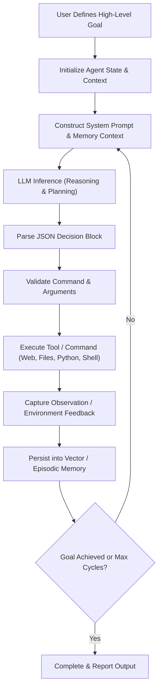
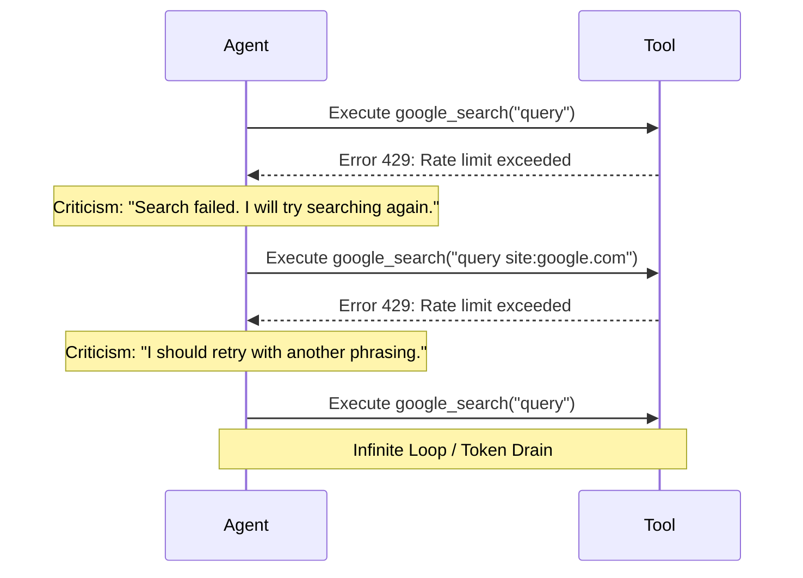
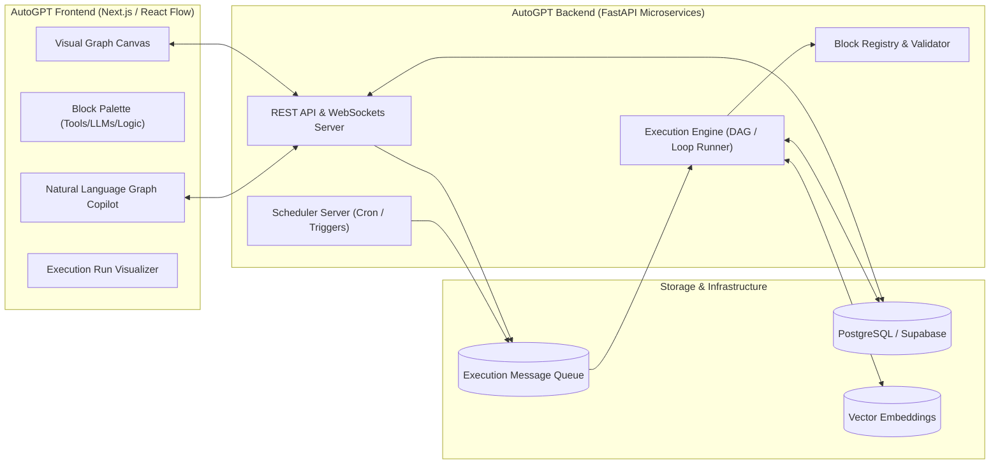

# AutoGPT: Technical Architecture, Evolution, and Enterprise Analysis

**Document Version:** 1.0.0  
**Status:** Complete Analysis & Technical Report  
**Target Audience:** AI Engineers, Platform Architects, Enterprise Workflow Developers  

---

## Executive Summary

**AutoGPT** represents one of the most influential milestones in the history of autonomous artificial intelligence. Released as an open-source project by **Toran Bruce Richards** (under the organization **Significant Gravitas**) in late March 2023, AutoGPT became one of the fastest-growing repositories in GitHub's history, surpassing 160,000+ stars within months.

AutoGPT challenged the prevailing paradigm of Large Language Models (LLMs) as passive, single-turn conversational chatbots (e.g., ChatGPT). Instead, it demonstrated that an LLM could be embedded within an **autonomous recursive feedback loop**—formulating its own sub-goals, executing external tools, critiquing its own output, reading/writing persistent storage, and iterating toward high-level objectives without continuous human intervention.

However, the journey of AutoGPT also exposed fundamental limitations of early unconstrained autonomous agents: **infinite execution loops ("death loops")**, **hallucinatory divergence**, **exponential token consumption**, and **brittle tool invocation**. 

In response to these industry-wide challenges, Significant Gravitas undertook a multi-year architectural evolution:
1. **Classic AutoGPT (2023):** Monolithic CLI script running a recursive `Thought -> Reasoning -> Plan -> Criticism -> Action` loop.
2. **The Standardization Era (2023–2024):** Creation of **AutoGPT Forge** (agent template boilerplate), **Agent Protocol** (an open REST standard for agent-client interoperability), and **agbenchmark** (reproducible agent evaluation framework).
3. **The AutoGPT Platform Era (2024–2026):** A transition to a visual, low-code, graph-based architecture (`autogpt_platform`). Workflows are modeled as directed graphs of deterministic and agentic **Blocks** executed by a distributed microservice backend (`FastAPI`, `executor`, `PostgreSQL/Supabase`, `React Flow`).

This report provides an in-depth technical analysis of AutoGPT's architecture, failure modes, structural redesigns, comparative positioning against competing frameworks (LangGraph, CrewAI, AutoGen), and actionable architectural takeaways for building enterprise-grade AI workflow platforms.

---

## 1. Genesis and the "Classic" AutoGPT Architecture (2023)

### 1.1 The Core Proposition: Autonomous Agentic Loops
Prior to AutoGPT, interaction with models like GPT-4 required users to manually decompose tasks, prompt the model step-by-step, copy-paste outputs, and execute actions manually. AutoGPT closed this loop programmatically.



### 1.2 The Cognitive Prompt Schema: Think-Act-Observe-Reflect
The central innovation of AutoGPT was enforcing a structured JSON response schema on top of raw LLM completions. Every cognitive step compelled the LLM to output its internal monologue broken down into five distinct analytical dimensions:

```json
{
  "thoughts": {
    "text": "I need to find the latest research papers on multimodal agent architectures.",
    "reasoning": "Searching arXiv directly via web search will provide recent peer-reviewed preprints without paywalls.",
    "plan": [
      "- Execute google search for recent arXiv papers on multimodal agents",
      "- Scrape top 3 abstracts",
      "- Summarize findings and save to workspace report.md"
    ],
    "criticism": "I should ensure I filter for papers published within the last 12 months so the information is timely."
  },
  "command": {
    "name": "google_search",
    "args": {
      "query": "arXiv multimodal agent architecture 2024 2025"
    }
  }
}
```

#### Breakdown of Cognitive Fields:
* **`thoughts.text` (Perception):** Current state interpretation and conceptual situation report.
* **`thoughts.reasoning` (Rationale):** Justification for why the intended next step is optimal.
* **`thoughts.plan` (Decomposition):** An ordered sub-task agenda tracking progress against the macro objective.
* **`thoughts.criticism` (Self-Correction):** Explicit meta-cognitive evaluation identifying potential edge cases, hallucinations, inefficiencies, or constraint violations.
* **`command` (Action Vector):** The concrete tool execution payload (name and typed arguments).

### 1.3 Tooling & Memory Architecture
Classic AutoGPT provided the model with an extensible tool chest:
* **Web Browsing:** Headless scraping via Playwright/Selenium, DuckDuckGo/Google search, summarization of oversized web content.
* **Filesystem & Code Execution:** Sandboxed or host read/write access, Python script execution, bash commands.
* **Sub-Agent Spawning:** Classic AutoGPT had the ability to spawn temporary child agents to offload sub-tasks (e.g., summarizing a 50-page document) and report findings back to the master agent.
* **Long-Term Memory:** Embedding-based retrieval using vector stores (**Chroma**, **Pinecone**, **Milvus**, or local JSON/cache). After each cycle, observations were embedded and queried via cosine similarity to mitigate context window truncation.

---

## 2. Early Pitfalls: Why Unconstrained Autonomy Failed in Production

While AutoGPT captured the imagination of the technology industry, real-world deployment quickly revealed critical structural limitations that prevented enterprise adoption of purely autonomous loops.

### 2.1 The "Infinite Death Loop" (Action Hallucination)
When an agent encountered an unexpected tool error (e.g., an HTTP 403 Forbidden, an anti-bot CAPTCHA, or an invalid file path), the self-reflective loop frequently degenerated into repetitive retries. The model's `criticism` module would acknowledge the error, formulate an identical or marginally rephrased command, and repeat the failure indefinitely.



### 2.2 Token Burn and Quadratic Context Degradation
Without deterministic graph boundaries, every cycle accumulated execution history. As the conversation history grew, the agent incurred two catastrophic penalties:
1. **Financial Cost:** Each step required re-sending the full system prompt, tool definitions, episodic memory excerpts, and complete prior conversation history. Running an agent for 50 cycles on GPT-4 often cost $15–$30+ without completing the goal.
2. **"Lost in the Middle" & Distraction:** As context windows filled up, LLMs suffered from attention drift. The agent would lose track of the primary goal, get sidetracked by secondary details, or repeat actions completed 20 steps prior.

### 2.3 Non-Determinism vs. Enterprise Compliance
Enterprises require guarantees:
* Auditable workflows.
* Enforced step sequences (e.g., Compliance Approval **must** precede Database Write).
* Hard boundaries on spending, execution time, and retry policies.

A single unconstrained LLM loop cannot provide mathematical or structural guarantees that it will not execute commands out of sequence or skip mandatory policy checks.

---

## 3. The Structural Pivot: Forge, Agent Protocol, and agbenchmark (2023–2024)

Recognizing that unconstrained script-based agents were insufficient for production-grade reliability, the Significant Gravitas team led a major initiative to professionalize and standardize agent engineering.

```
+-------------------------------------------------------------------------+
|                         Significant Gravitas Ecosystem                  |
+-------------------------------------------------------------------------+
|                                                                         |
|   +--------------------+   Agent Protocol   +-----------------------+   |
|   |   AutoGPT Forge    | <================> |      agbenchmark      |   |
|   | (Custom Agent SDK) |     (REST API)     | (Standard Test Suite) |   |
|   +--------------------+                    +-----------------------+   |
|             |                                           |               |
|             v                                           v               |
|   Standardized Agent DB & Task Steps         Quantitative Leaderboards  |
|                                                                         |
+-------------------------------------------------------------------------+
```

### 3.1 Agent Protocol
Developed under the **AI Engineer Foundation**, the **Agent Protocol** established an open, framework-agnostic REST API specification. It decoupled the client (benchmarks, UI frontends, orchestrators) from the internal agent implementation.

#### Core Endpoints:
| Method | Endpoint | Description |
|---|---|---|
| `POST` | `/ap/v1/agent/tasks` | Creates a new autonomous task session with an input payload. |
| `GET` | `/ap/v1/agent/tasks/{task_id}` | Retrieves task status, configuration, and state. |
| `POST` | `/ap/v1/agent/tasks/{task_id}/steps` | Executes a single step of the task (enabling external step control). |
| `GET` | `/ap/v1/agent/tasks/{task_id}/steps/{step_id}` | Retrieves execution step details, thoughts, and action outcomes. |
| `GET` | `/ap/v1/agent/tasks/{task_id}/artifacts` | Lists artifacts (files, documents, code) produced by the agent. |
| `POST` | `/ap/v1/agent/tasks/{task_id}/artifacts` | Uploads an artifact into the agent's isolated workspace. |

By standardizing step execution, the Agent Protocol eliminated proprietary wrappers and allowed any agent built in any language to be driven step-by-step by external schedulers or human-in-the-loop interfaces.

### 3.2 AutoGPT Forge
**Forge** served as the development template/SDK. Instead of developers reinventing CLI flags, database integrations, vector store connections, and API endpoints, Forge provided a clean scaffold:
* Pre-configured Agent Protocol endpoints.
* Built-in file management and workspace isolation.
* Pluggable LLM interfaces (OpenAI, Anthropic, HuggingFace, local models).
* Developer hook: `agent.execute_step(task_id, step)` where developers write domain-specific cognitive logic.

### 3.3 agbenchmark (Agent Benchmark)
To move agent development from subjective anecdotes ("it felt smarter today") to rigorous engineering, Significant Gravitas built `agbenchmark`.
* **Standardized Test Suites:** Hundreds of discrete challenges covering coding (writing and fixing unit tests), web navigation, retrieval, memory recall, and file transformations.
* **Deterministic Grading:** The benchmark runs the agent in an isolated environment and automatically asserts file contents, exit codes, and database states.
* **Elimination of Regression:** Allowed continuous integration (CI/CD) pipelines to measure agent success rates across model updates.

---

## 4. The Modern AutoGPT Platform Architecture (2024–2026)

The culmination of these architectural lessons is the **AutoGPT Platform** (`autogpt_platform`), located in the monorepo alongside the legacy `classic/` tree. The platform transforms AutoGPT from a single agent into a **visual, node-based, distributed workflow orchestrator**.



### 4.1 Component Architecture

#### 1. Visual Frontend (`frontend/`)
* **React Flow Canvas:** Enables users and developers to visually compose workflows by dragging, dropping, and connecting blocks.
* **Edge Semantics:** Connections represent typed data pipelines and execution triggers.
* **Copilot Assistant:** An embedded AI assistant capable of translating high-level natural language instructions ("Build an agent that monitors competitor pricing daily and alerts Slack") into connected node graphs automatically.
* **Artifact & Run Inspector:** Real-time step inspection, intermediate input/output examination, and log streaming via WebSockets.

#### 2. Microservice Backend (`backend/`)
* **`rest_server`:** Handles user authentication, graph definitions, block metadata, and CRUD operations.
* **`executor`:** The core execution engine. It resolves graph dependencies, manages topological sorting, handles fan-out/fan-in parallel branches, and invokes block handlers.
* **`scheduler_server`:** Manages continuous background agents, webhooks, and cron-like recurring triggers.
* **`websocket_server`:** Streams high-frequency node execution events, token generation, and state transitions to the UI.

### 4.2 The "Block" Primitive: Building Blocks of Modern Agents
In modern AutoGPT, every capability is encapsulated inside an isolated, strongly-typed **Block**. 

#### Block Anatomy:
Every block inherits from a base `Block` class and utilizes **Pydantic** schemas for input and output validation:

```python
from pydantic import BaseModel, Field
from backend.data.block import Block, BlockCategory, BlockOutput
from backend.data.model import BlockSchema

class TextSummarizerInput(BaseModel):
    text: str = Field(..., description="The raw content to summarize")
    max_words: int = Field(default=150, description="Target summary length")

class TextSummarizerOutput(BaseModel):
    summary: str = Field(..., description="The generated summary")
    compression_ratio: float = Field(..., description="Original vs summary length ratio")

class TextSummarizerBlock(Block):
    class Schema(BlockSchema):
        id: str = "d48e71b2-2938-4f11-85f2-95b7c89c8a01"
        name: str = "Text Summarizer Block"
        description: str = "Summarizes long-form content using configured LLM models."
        category: BlockCategory.TEXT
        input_schema: type[BaseModel] = TextSummarizerInput
        output_schema: type[BaseModel] = TextSummarizerOutput

    async def run(self, input_data: TextSummarizerInput) -> BlockOutput:
        # 1. Processing Logic
        summary = await call_llm_summarize(input_data.text, input_data.max_words)
        ratio = len(summary) / max(len(input_data.text), 1)
        
        # 2. Structured Output Emission
        yield "summary", TextSummarizerOutput(summary=summary, compression_ratio=ratio)
```

#### Why Blocks Solve Classic AutoGPT Flaws:
1. **Schema Safety:** Inputs and outputs are strictly typed. Broken JSON payloads from LLMs are caught and corrected before reaching downstream nodes.
2. **Reusability & Composability:** Blocks can represent pure code (e.g., Python transforms, regex parsing), deterministic integrations (e.g., GitHub, Slack, Hunter.io, PostgreSQL), or autonomous sub-agents.
3. **Sub-Graphs:** An entire graph of blocks can be packaged and referenced as a single composite block inside another parent graph.

---

## 5. Comparative Framework Analysis

To understand AutoGPT's position in the modern AI ecosystem, it must be evaluated alongside other leading agentic frameworks: **LangGraph**, **CrewAI**, and **Microsoft AutoGen**.

| Dimension | AutoGPT Platform (2026) | LangGraph (LangChain) | CrewAI | Microsoft AutoGen |
|---|---|---|---|---|
| **Primary Philosophy** | Visual Block Graphs + Autonomous Copilot + Hosted Cloud | Code-first Cyclic State Machine Graphs | Role-playing Multi-Agent Teams with Task Pipelines | Multi-Agent Conversational Collaboration |
| **Workflow Definition** | Low-Code UI (React Flow) + Python Block SDK | Code-first (Python/TypeScript state graphs) | Declarative Python (Agents, Tasks, Crews) | Declarative Python (ConversableAgent, GroupChat) |
| **Control Flow** | Directed Graphs with branching, loops, and parallel nodes | StateGraphs with conditional edges & state checkpoints | Sequential, Hierarchical, or Process-based | Conversational turns, speaker selection, state transitions |
| **Human-in-the-Loop** | Native UI approval nodes & execution pausing | First-class breakpoint support (`interrupt_before/after`) | Task-level human review flags | Interactive human-input modes (`ALWAYS`, `TERMINATE`, `NEVER`) |
| **Persistence & State** | PostgreSQL / Supabase with run execution snapshots | Pluggable checkpointers (Postgres, Redis, Sqlite) | In-memory with optional task cache | In-memory session state |
| **Visual Builder** | **Native first-class UI** with instant execution visualizer | LangGraph Studio (desktop/cloud IDE) | Third-party UI / CrewAI Enterprise Cloud | AutoGen Studio |
| **Target User** | AI Engineers, Technical PMs, Enterprise Workflow Developers | Python/TypeScript Backend Engineers | Rapid Prototyping Engineers & Multi-agent Designers | Multi-agent Researchers & Systems Architects |

### Critical Differentiation:
* **AutoGPT** has transitioned towards becoming a **complete operating platform**—offering a visual builder, block marketplace, scheduler, hosted infrastructure, and open-source codebase.
* **LangGraph** focuses on providing fine-grained, low-level programmatic control over state machines and cyclic graphs for backend software engineers.
* **CrewAI** emphasizes role-based collaboration where agents take on distinct personas (e.g., "Researcher", "Writer") in structured pipelines.
* **AutoGen** focuses on multi-agent conversational patterns where complex problems are solved through peer-to-peer dialogues.

---

## 6. Enterprise Strengths, Weaknesses, and Failure Analysis

### 6.1 Key Strengths of the Modern Platform
1. **Hybrid Execution Model (Deterministic + Autonomous):** By modeling workflows as graphs, developers can enforce deterministic routing where compliance is required (e.g., Data Sanitization -> PII Masking) while delegating creative steps (e.g., Copywriting, Analytical Synthesis) to autonomous blocks.
2. **Visual Transparency & Debuggability:** Visualizing data flowing across nodes eliminates the "black box" nature of early autonomous scripts. Engineers can inspect exactly which node received what input and where an error occurred.
3. **Standardized Extensibility:** Creating custom integrations requires only writing a standard Python class inheriting from `Block` with Pydantic validation.
4. **Resilience to Model Provider Lock-in:** The platform natively supports multi-model architectures—executing simple data extraction on cost-effective local models (e.g., Llama 3/4 via Ollama) while routing complex reasoning nodes to frontier models (Claude 3.7 Sonnet, GPT-4o, Gemini 2.0).

### 6.2 Remaining Weaknesses & Challenges
1. **Dynamic Task Reformulation:** While visual graphs excel at predefined and semi-dynamic workflows, purely open-ended problems ("Explore our company codebase and fix any bugs you encounter") are harder to express as static block diagrams without reverting to open-loop agents.
2. **Distributed State Complexity:** In complex cyclic graphs with concurrent execution branches, race conditions in state merging and variable scope resolution can arise.
3. **Enterprise Governance Overhead:** Self-hosting the full microservice suite (Next.js frontend, FastAPI backend, executor workers, PostgreSQL, vector storage) requires substantial DevOps infrastructure compared to lightweight embedded libraries (such as simple LangGraph or CrewAI scripts).

---

## 7. Strategic Recommendations for Enterprise AI Workflow Platforms

For organizations building or scaling an internal **Enterprise AI Workflow Platform**, the historical evolution and architecture of AutoGPT offer vital architectural blueprints:

```
+-------------------------------------------------------------------------+
|                  Enterprise AI Platform Architectural Pillars           |
+-------------------------------------------------------------------------+
|                                                                         |
|  [Pillar 1: Deterministic Guardrails with Autonomous Nodes]             |
|  - Never allow an autonomous loop to dictate high-risk business logic.  |
|  - Constrain agents inside validated graph boundaries.                  |
|                                                                         |
|  [Pillar 2: Universal Protocol Standards (Agent Protocol & MCP)]        |
|  - Decouple execution runtime from the presentation layer.             |
|  - Standardize tool access via Model Context Protocol (MCP).            |
|                                                                         |
|  [Pillar 3: Explicit Cognitive Tracing & Budget Hardstops]              |
|  - Isolate Thought, Reasoning, Plan, and Action schemas.               |
|  - Enforce per-workflow token, latency, and financial circuit breakers.|
|                                                                         |
|  [Pillar 4: Human-in-the-Loop (HITL) Checkpoints]                       |
|  - Provide visual pause-and-resume approval gates for external actions. |
|                                                                         |
+-------------------------------------------------------------------------+
```

### 1. Enforce Hybrid Architectures: Constrained Graphs with Autonomous Nodes
* **Rule:** Do not let a single LLM loop control both execution routing and task execution.
* **Implementation:** Use a deterministic directed acyclic graph (DAG) or state machine for the overall business process. Deploy autonomous agent loops only as specialized workers within specific nodes of that graph.

### 2. Implement Cognitive Schemas and Structured Output Validation
* Follow AutoGPT’s pioneering design of separating `Thoughts`, `Reasoning`, `Plan`, and `Criticism`.
* Enforce Pydantic validation on all LLM responses. If validation fails, route through an automated repair handler rather than crashing the workflow.

### 3. Integrate Universal Tool Protocols (Model Context Protocol / MCP)
* Rather than hardcoding custom tool connectors, standardize tool discovery and invocation on open protocols such as Anthropic’s **Model Context Protocol (MCP)** and REST-based **Agent Protocol**. This ensures that enterprise integrations (databases, ERPs, CRM APIs) remain reusable across different agent engines.

### 4. Implement Rigorous Financial and Loop Circuit Breakers
* To prevent runaway "death loops":
  * Enforce maximum execution cycle limits ($N \le 10$).
  * Enforce sliding-window token budgets per task.
  * Implement semantic loop detection: compute cosine similarity across consecutive agent action vectors; if the similarity score between consecutive steps exceeds $0.95$ with identical tools, trip the circuit breaker and alert a human supervisor.

### 5. Benchmark-Driven Development (Evaluation First)
* Before deploying any enterprise agent to production, establish an objective evaluation suite modeled on `agbenchmark`. Test agents systematically against historical tasks with verified outputs to measure regression before upgrading underlying LLM versions.

---

## 8. Conclusion

AutoGPT holds a unique place in artificial intelligence history. It was the catalyst that proved LLMs could act as autonomous reasoning engines capable of planning and interacting with the digital world. While its initial incarnation demonstrated the fragility of unconstrained recursive autonomy, its transformation into the modern **AutoGPT Platform** mirrors the broader maturation of the agentic AI industry: moving away from chaotic prompt loops toward **structured, type-safe, graph-based architectures with visual observability and human oversight**.

For enterprise engineering teams, AutoGPT provides both a cautionary tale and an indispensable reference architecture for building scalable, reliable, and observable AI-driven automation.
