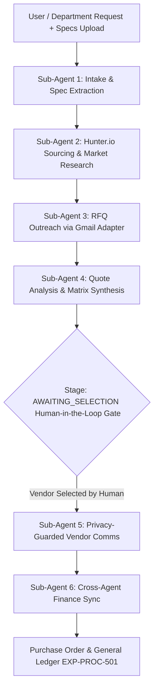

# Autonomous Procurement Multi-Agent System Implementation Report

**Author:** Antigravity AI Engineering Team  
**Date:** August 20, 2026  
**System:** Enterprise AI Workflow Platform  
**Target Architecture:** Multi-Agent Supervisor DAG Pattern (FastAPI + Node.js Express Gateway + PostgreSQL + Next.js Frontend)

---

## 1. Executive Summary

This report documents the architectural design, database migration schema, backend routing, Python sub-agent microservices, and Next.js frontend hub for the **Autonomous Procurement Multi-Agent System**.

Moving away from single-node agent patterns, the new system implements a **Supervisor Agent Pattern** (`ProcurementSupervisor`). The supervisor orchestrates a 6-stage Directed Acyclic Graph (DAG) across **six specialized sub-agents**. The pipeline ingests multi-format procurement specifications, conducts vendor market research via Hunter.io, dispatches RFQ packages, synthesizes vendor quote matrixes, enforces a **Human-in-the-Loop (HITL)** selection decision, dispatches **privacy-guarded** vendor communications, and automatically synchronizes Purchase Orders with the **Finance Agent**.

---

## 2. Supervisor Architecture & Multi-Agent DAG Breakdown

The system is organized into a top-level **Supervisor Engine** and six domain-specific **Sub-Agents**, located under `agent/graph/procurement/`:

### 2.1 Supervisor Engine (`supervisor.py`)
- **Class**: `ProcurementSupervisor`
- **Role**: Coordinates lifecycle state transitions for `procurement_requests`. Maintains system state in PostgreSQL and determines which sub-agent is active based on the `current_stage` field.
- **Stage Graph**:
  1. `INTAKE` $\rightarrow$ Sub-Agent 1 (`intake_spec`)
  2. `RESEARCHED` $\rightarrow$ Sub-Agent 2 (`vendor_research`)
  3. `RFQ_DISPATCHED` $\rightarrow$ Sub-Agent 3 (`rfq_outreach`)
  4. `REPLIES_PARSED` / `AWAITING_SELECTION` $\rightarrow$ Sub-Agent 4 (`negotiation_synthesis`)
  5. `NOTIFIED` $\rightarrow$ Sub-Agent 5 (`vendor_comms`)
  6. `COMPLETED` $\rightarrow$ Sub-Agent 6 (`finance_sync`)

---

### 2.2 Deep Dive into the 6 Specialized Sub-Agents

#### 1. Intake & Specification Sub-Agent (`subagents/intake_spec.py`)
- **Purpose**: Ingests raw text requirements and attached RFP documents (`.pdf`, `.docx`, `.txt`).
- **Core Functionality**:
  - Parses uploaded document streams (`procurement_documents`).
  - Extracts structured technical requirements, expected deliverables, service level agreements (SLAs), and budget limits.
  - Validates budget limits against department allocation caps.

#### 2. Vendor Research & Market Analysis Sub-Agent (`subagents/vendor_research.py`)
- **Purpose**: Performs vendor candidate discovery and enriches lead deliverability using the **Hunter.io API** and targeted web research.
- **Core Functionality**:
  - Discovers vendor domains and primary procurement contacts.
  - Validates email deliverability (`VALID`, `RISKY`, `DELIVERABLE`).
  - Compiles the **Market Research Report** detailing industry trends, candidate fit scores (0–100), and pricing estimates.

#### 3. RFQ Outreach Sub-Agent (`subagents/rfq_outreach.py`)
- **Purpose**: Generates standardized Request for Quotation (RFQ) packages and manages outbound outreach.
- **Core Functionality**:
  - Synthesizes personalized RFQ email copy containing technical specs, submission deadlines, and pricing templates.
  - Dispatches emails via the internal Gmail/Email adapter.
  - Updates vendor statuses to `RFQ_SENT`.

#### 4. Negotiation Synthesis Sub-Agent (`subagents/negotiation_synthesis.py`)
- **Purpose**: Analyzes inbound vendor responses and quote proposals.
- **Core Functionality**:
  - Extracts offered prices, lead times (days), SLA scores (1–10), and payment terms.
  - Calculates budget variance percentages (`variance_from_budget_pct`).
  - Compiles the **Vendor Quote Comparison Matrix** and highlights top AI-recommended candidates.
  - Transitions request stage to `AWAITING_SELECTION` for human approval.

#### 5. Vendor Communications Sub-Agent (`subagents/vendor_comms.py`)
- **Purpose**: Handles post-decision vendor notifications.
- **Core Functionality**:
  - **Selected Vendor**: Dispatches formal acceptance notification with next steps for contract execution.
  - **Non-Selected Vendors**: Dispatches polite regret notifications.
  - **🔒 Strict Privacy Guardrail**: Prompts and verifier layers explicitly ensure that non-selected vendors receive **no disclosure** regarding the winning vendor's identity, quote amount, or specific contract terms.

#### 6. Finance Sync Sub-Agent (`subagents/finance_sync.py`)
- **Purpose**: Cross-domain integration with the Finance Agent and General Ledger.
- **Core Functionality**:
  - Generates official Purchase Orders (`PO-2026-PROC-XXXX`).
  - Creates budget reservation entries in the General Ledger under expense code `EXP-PROC-501`.
  - Publishes cross-agent audit logs (`NOTIFY_FINANCE_PROCUREMENT_CLOSED`).

---

## 3. Database Schema (`027_procurement_agent_v2_schema.sql`)

The persistence layer is structured across four primary PostgreSQL tables:

### 3.1 `procurement_requests`
| Column | Type | Description |
| :--- | :--- | :--- |
| `id` | `UUID (PK)` | Unique request identifier |
| `tenant_id` | `VARCHAR(255)` | Multi-tenant isolation key |
| `title` | `VARCHAR(255)` | Procurement title |
| `budget_limit` | `NUMERIC(15,2)` | Approved budget ceiling |
| `current_stage` | `VARCHAR(50)` | Stage: `INTAKE`, `RESEARCHED`, `RFQ_DISPATCHED`, `AWAITING_SELECTION`, `COMPLETED` |
| `active_subagent` | `VARCHAR(50)` | Active sub-agent key |
| `extracted_specs` | `JSONB` | Structured requirements & SLAs |
| `research_report` | `JSONB` | Market research & fit scores |
| `comparison_matrix` | `JSONB` | Vendor quote matrix |
| `po_number` | `VARCHAR(100)` | Generated Purchase Order number |

### 3.2 `procurement_vendors`
| Column | Type | Description |
| :--- | :--- | :--- |
| `id` | `UUID (PK)` | Unique vendor record ID |
| `request_id` | `UUID (FK)` | Reference to `procurement_requests` |
| `vendor_name` | `VARCHAR(255)` | Vendor company name |
| `vendor_email` | `VARCHAR(255)` | Contact email |
| `deliverability_status`| `VARCHAR(50)` | Hunter.io status (`VALID`, `RISKY`) |
| `contact_status` | `VARCHAR(50)` | Status (`DISCOVERED`, `RFQ_SENT`, `REPLIED`, `SELECTED`, `REJECTED`) |
| `quote_amount` | `NUMERIC(15,2)` | Submitted bid amount |
| `lead_time_days` | `INTEGER` | Offered fulfillment timeframe |
| `sla_score` | `NUMERIC(3,1)` | SLA score rating |

### 3.3 Supporting Tables
- **`procurement_documents`**: Stores metadata and file paths for uploaded RFP specs (`.pdf`, `.docx`).
- **`procurement_agent_logs`**: Multi-agent audit trail tracking stage transitions, execution timestamps, and sub-agent outputs.

> **Note**: Migration file `027_procurement_agent_v2_schema.sql` was created in `backend/database/migrations/` and is ready for manual database execution by the administrator.

---

## 4. API & Microservice Integration Layer

### 4.1 FastAPI Agent Service (`agent/routers/procurement_agent.py`)
- `POST /agent/procurement/run-supervisor`: Triggers supervisor orchestration flow.
- `POST /agent/procurement/subagent/{subagent_name}`: Invokes a specific sub-agent directly.
- Mounted centrally in `agent/main.py`.

### 4.2 Express API Gateway (`backend/src/routes/procurement.js`)
- `GET /api/v1/procurement/requests`: Lists all active procurement requests.
- `POST /api/v1/procurement/requests`: Ingests new procurement requests and handles file uploads (`multer` disk storage).
- `POST /api/v1/procurement/requests/:id/select-vendor`: Submits Human-in-the-Loop vendor selection decisions.
- Registered in `backend/src/index.js` under `/api/v1/procurement`.

---

## 5. Next.js Frontend Procurement Agent Hub

The user interface is implemented at `frontend/src/app/procurement/page.js` and linked in `Sidebar.js`.

### Key UI Features:
1. **Analytics KPI Header**: Live metrics for active requests, discovered vendors, pending HITL decisions, and executed POs.
2. **6 Interactive Sub-Agent Tabs**:
   - **Tab 1 (Intake & Specs)**: Form for requirement text, department selection, budget caps, and RFP spec file uploads.
   - **Tab 2 (Vendor Research)**: Candidate cards with deliverability badges and Market Fit Report details.
   - **Tab 3 (RFQ Outreach)**: Log of dispatched RFQ emails and status indicators.
   - **Tab 4 (Matrix & HITL Decision)**: Quote Comparison Matrix table and **Human-in-the-Loop Selection Gate** form.
   - **Tab 5 (Vendor Comms)**: Privacy audit logs showing acceptance and regret email dispatch status.
   - **Tab 6 (Finance Sync)**: PO details (`PO-2026-PROC-XXXX`) and General Ledger synchronization checkmarks (`EXP-PROC-501`).

---

## 6. Security, Privacy & Compliance Controls

1. **Non-Disclosure Privacy Check**:
   During regret email dispatch (Sub-Agent 5), automated checks guarantee that non-selected vendors are not provided with details regarding the winning vendor or competitive bid amounts.
2. **Multi-Tenant Isolation**:
   Every database query filters by `tenant_id` resolved from JWT tokens.
3. **Human-in-the-Loop (HITL) Gate**:
   The workflow explicitly halts at `AWAITING_SELECTION` before committing vendor selection or binding financial PO commitments.

---

## 7. Verification & Build Validation

| Verification Step | Target File(s) | Status / Result |
| :--- | :--- | :--- |
| **Python Syntax & Compilation** | `agent/graph/procurement/**/*.py`, `agent/routers/procurement_agent.py` | `python3 -m py_compile` passed with **0 errors**. |
| **Node.js Gateway Validation** | `backend/src/routes/procurement.js`, `backend/src/index.js` | `node -c` passed with **0 errors**. |
| **Next.js Production Build** | `frontend/src/app/procurement/page.js` | `npm run build` completed successfully (`✓ Compiled successfully in 14.6s`). Static route `/procurement` generated. |

---

## 8. Conclusion

The Autonomous Procurement Multi-Agent System provides a robust, scalable supervisor architecture for modern enterprise purchasing. By combining document parsing, external vendor discovery via Hunter.io, automated matrix synthesis, human oversight, and direct Finance Agent synchronization, the system minimizes procurement friction while maintaining strict privacy and audit compliance.
