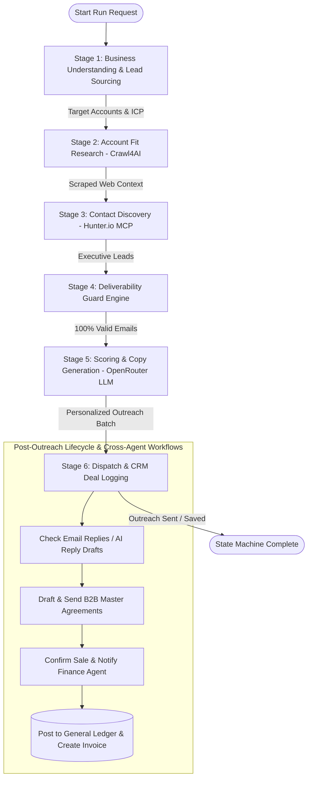

# AI Sales SDR Agent — Architectural & System Analysis

## 1. Executive Summary

The **AI Sales SDR Agent** is an autonomous, multi-agent enterprise prospecting and sales execution pipeline built on **LangGraph**. It handles end-to-end B2B outbound sales—from Knowledge Base-grounded Ideal Customer Profile (ICP) synthesis and account sourcing to website scraping, email deliverability verification, LLM copy generation, proposal drafting, and cross-agent financial ledger integration.

---

## 2. System Architecture & 6-Stage Pipeline Flow

---

## 3. Detailed Stage-by-Stage Analysis

| Stage | Node Function | External Tool / Service | Key Output & State Updates |
| :--- | :--- | :--- | :--- |
| **1. Business Understanding** | `business_understanding_node` | Hunter.io API / PostgreSQL | Retrieves ICP parameters, deduplicates against previously targeted tenant domains/emails, and sources candidate accounts. |
| **2. Account Fit Check** | `account_fit_research_node` | Crawl4AI / Fast HTTP Fetch | Scrapes target company landing pages to extract business model and pain points before incurring contact finding costs. |
| **3. Contact Discovery** | `contact_discovery_node` | Hunter.io Domain Search | Searches for direct decision-maker profiles (e.g. VP of Sales, CTO, Head of Growth) matching target titles. |
| **4. Deliverability Guard** | `deliverability_guard_node` | Email Verifier Engine (DNS, MX, RFC) | Validates email syntax, checks MX DNS records, filters disposable providers & synthetic pattern addresses to safeguard domain reputation. |
| **5. Scoring & Copy Generation** | `scoring_copy_gen_node` | OpenRouter LLM (`get_llm`) + Tenant Context | Calculates 0-100 ICP fit scores and drafts personalized outreach copy signed by tenant brand context (`get_tenant_company_context`). |
| **6. Dispatch & CRM Logging** | `dispatch_closing_node` | Gmail API Adapter + PostgreSQL | Sends emails via Gmail OAuth if `auto_send_email=True`, upserts leads into `sales_prospects` table, and sets deal stages (`DISCOVERED` or `OUTREACH_SENT`). |

---

## 4. Key Sub-Systems & Feature Modules

### A. Grounded ICP Auto-Synthesis from Knowledge Base
- **Endpoint**: `POST /api/v1/sales/icp/build` -> `POST /agent/sales/icp/build`
- **Mechanism**: Scans Qdrant vector store and tenant-uploaded documents via RAG (`query_rag`, `fetch_all_tenant_chunks`). An LLM synthesizes target titles, industries, company size ranges, battlecard differentiators, and sales hooks directly grounded in the company's real documentation.

### B. Multi-Tenancy & Strict Data Isolation
- **Tenant Context**: All database operations (`sales_prospects`, `sales_icp_configs`, `tenant_hunter_settings`) enforce UUID normalization and explicit `tenant_id = $1` filters.
- **Credential Scoping**: Hunter.io API keys and Gmail OAuth tokens are fetched per tenant via `fetch_tool_credentials(tenant_id, tool_id)`.

### C. Email Reply Tracking & Autonomous Conversational AI
- **Endpoint**: `POST /api/v1/sales/check-replies` & `POST /api/v1/sales/send-reply`
- **Mechanism**: Periodically checks tenant Gmail inbox for inbound prospect responses (`from:contact_email`), updates deal stages (`REPLIED`, `PROPOSAL_REQUESTED`), and drafts tailored AI responses.

### D. Human-in-the-Loop Proposal & B2B Agreement Engine
- **Endpoint**: `POST /api/v1/sales/proposals/draft` & `POST /api/v1/sales/proposals/send`
- **Mechanism**: Generates structured JSON B2B agreements containing executive summaries, key deliverables, deal values, and SLA terms. Pauses execution for human review prior to dispatching via Gmail API.

### E. Cross-Agent Financial Ledger & Invoice Automation
- **Endpoint**: `POST /api/v1/sales/deal/confirm-sale`
- **Mechanism**: On deal closure (`CLOSED_WON`):
  1. Updates prospect record with final contract value.
  2. Generates a formal **Sales Completion Report**.
  3. Automatically posts a revenue transaction to the `general_ledger` table (`account_code: REV-SALES-101`).
  4. Issues an `APPROVED` / `RECONCILED` invoice in the `invoices` table.
  5. Inserts a cross-agent audit record in `audit_logs`.

### F. Real-Time Sales Performance Analytics
- **Endpoint**: `GET /api/v1/sales/analytics`
- **Metrics Tracked**: Total prospects, contacted count, reply count, deals won, total revenue ($), active pipeline value ($), reply rate (%), and conversion rate (%).

---

## 5. Technical Stack Summary

- **Orchestration**: LangGraph StateGraph (`SalesAgentState`)
- **Backend Services**: Express.js Gateway (`backend/src/routes/sales.js`) ↔ Python FastAPI Microservice (`agent/routers/sales_agent.py`)
- **Lead Sourcing & Enrichment**: Hunter.io MCP Connection & Tool Gateway
- **Web Scraping**: Crawl4AI + HTTP Fast Fetch
- **LLM Gateway**: OpenRouter (LangChain System/Human Messages)
- **Database**: PostgreSQL (`sales_prospects`, `sales_icp_configs`, `tenant_hunter_settings`, `general_ledger`, `invoices`, `audit_logs`)
